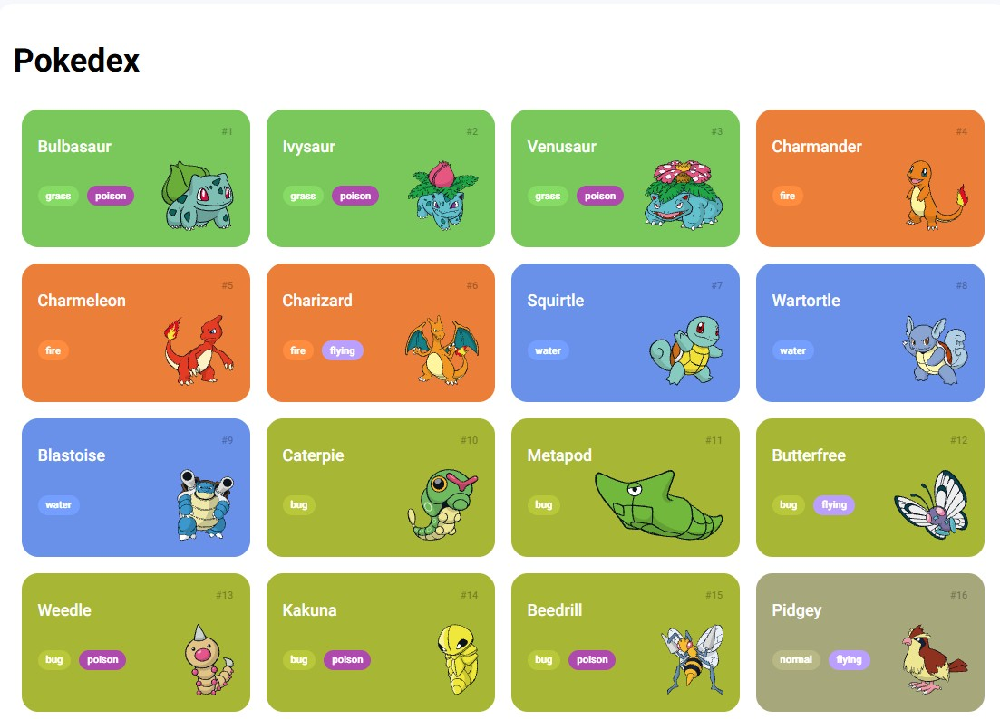
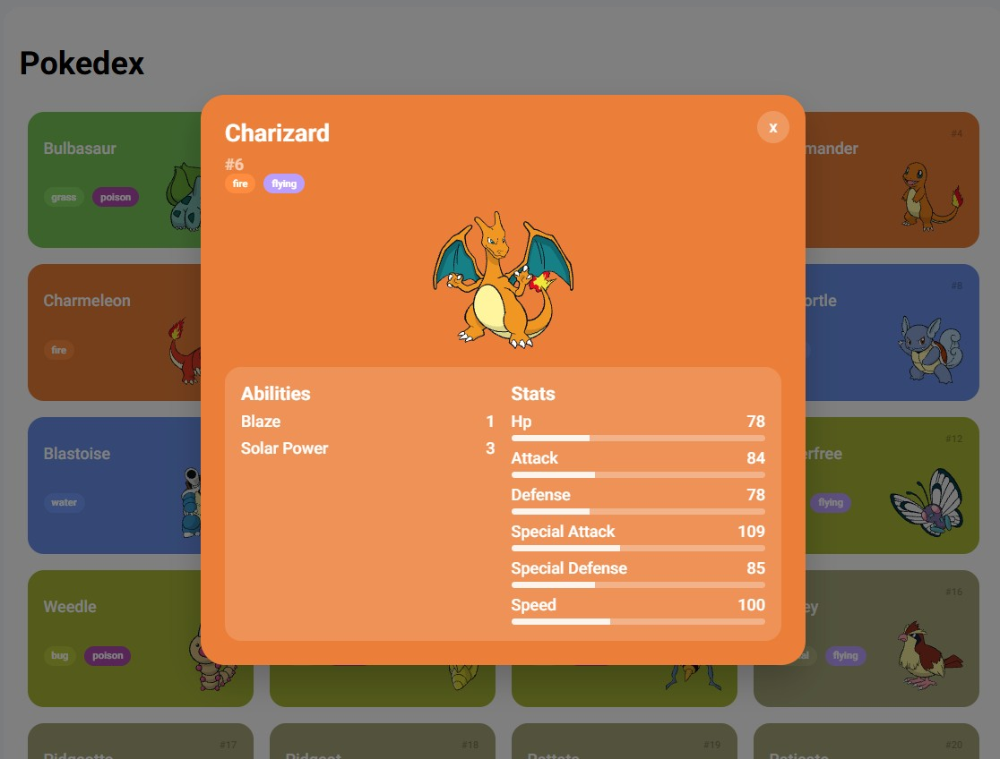

# Trilha JS Developer - Desafio Pokedex

Projeto pratico da trilha JS Developer da DIO, focado em consumo de API REST e fundamentos de desenvolvimento web. A ideia foi construir uma Pokedex funcional e depois aplicar melhorias pessoais.

## Melhoria aplicada

Implementei um modal que abre ao clicar no card do pokemon. O modal reaproveita o tema por tipo e mostra:

- Numero, nome, tipos e imagem.
- Abilities com nome e valor.
- Stats com barras proporcionais ao valor da API.

Detalhes adicionais da melhoria:

- Clique no card inteiro e suporte a teclado (Enter e espaco) para abrir o modal.
- Fechamento por botao, clique fora e tecla Esc.
- Reaproveitamento de estilos de tipos no modal para manter a identidade visual da lista.

## Creditos

Desafio original da DIO: https://github.com/digitalinnovationone/js-developer-pokedex
